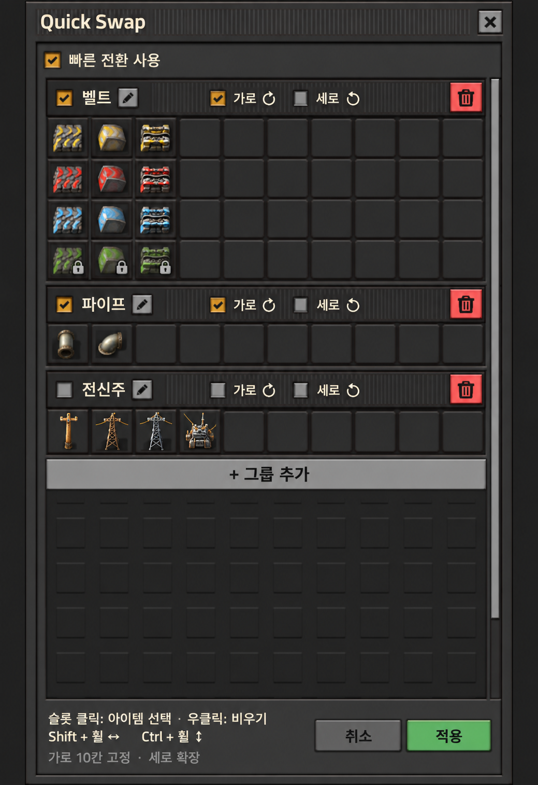

# Quick Swap — 사용자 정의 전환 그룹 기획서

- 상태: 물류 UI 기반 시안 승인, 0.3.x 구현 반영
- 작성일: 2026-09-13
- 기존 동작 기준: [FEATURE_SPEC.md](FEATURE_SPEC.md)
- UI 기준: 사용자가 제공한 Factorio 개인 물류·우주선 물류 UI와 이를 바탕으로 승인한 아래 시안.
- UI 구조는 승인 내용을 반영한다. 구현 시 결정한 세부 사항과 검증 범위는 12절에 기록한다.

시안은 배치와 스타일의 기준이다. 실제 구현은 Factorio 기본 GUI 스타일과 아이콘을 사용한다.
시안의 전신주 사용 체크 해제는 표시 예시이며, 최초 기본 그룹 3개는 모두 사용 상태로 생성한다.

## 1. 목적

손에 든 아이템을 마우스 휠로 빠르게 교체하는 기존 컨셉을 유지한다.
고정된 아이템 계열 대신 사용자가 직접 구성한 2차원 배열을 전환 기준으로 사용한다.
기존 벨트·파이프·전신주 동작은 기본 그룹으로 제공하여 설정 없이도 사용할 수 있게 한다.

## 2. 사용자 흐름

1. 화면 좌측 상단의 Quick Swap 버튼을 누른다.
2. 설정 팝업에 세로로 나열된 기본 그룹을 편집하거나 새 그룹을 만든다.
3. 배열의 슬롯을 눌러 연구로 해금된 아이템을 선택한다.
4. 가로 10칸의 슬롯에 아이템을 배치한다. 마지막 행을 사용하면 다음 빈 행이 생기며 세로로 확장된다.
5. 적용 버튼을 눌러 저장하고 창을 닫는다.
6. 등록한 아이템을 손에 들고 Shift+휠로 가로, Ctrl+휠로 세로 이동한다.

팝업은 설정할 때만 필요하다. 실제 전환은 팝업을 닫은 상태에서도 동작한다.
배열 설정은 물류 요청이나 아이템 운송을 발생시키지 않는다.

## 3. 팝업 구성

| 영역 | 구성 |
| --- | --- |
| 상단 | Quick Swap 제목, 닫기 버튼, 전체 빠른 전환 사용 체크박스 |
| 본문 | 물류 섹션처럼 그룹을 위에서 아래로 쌓는 단일 스크롤 영역 |
| 각 그룹 제목줄 | 사용 체크박스, 그룹 이름, 연필 모양 이름 수정 버튼, 위·아래 순서 변경 버튼, 가로·세로 순환 체크박스, 빨간 삭제 버튼 |
| 각 그룹 내용 | 제목줄 바로 아래에 붙는 작은 정사각형 슬롯, 모든 행 가로 10칸 고정 |
| 그룹 목록 끝 | 전체 폭의 얇은 `+ 그룹 추가` 버튼 |
| 하단 | 슬롯 조작·실제 할당된 네 방향 단축키 안내, 가로 10칸 고정·세로 확장 안내, 취소·적용 |

개인 물류 UI의 좁은 제목줄, 어두운 슬롯 배경, 기본 체크박스와 버튼 밀도를 따른다.
별도 왼쪽 그룹 목록, 큰 배열 편집 패널, 행·열 크기 조절 도구는 사용하지 않는다.
물류 요청 수량과 폐기 슬롯은 표시하지 않는다. 슬롯에는 전환할 아이템과 필요한 잠금 표시만 둔다.
본문 높이는 화면 안에 유지하고, 늘어나는 행과 그룹은 세로 스크롤로 접근한다.

### 편집 규칙

- 슬롯을 클릭하면 Factorio 기본 아이템 선택 UI를 활용해 아이템을 선택한다.
- 선택 가능한 항목은 지원 대상이면서 현재 세력에서 해금된 아이템이다.
- 인벤토리에 없는 아이템도 배열에는 등록할 수 있다.
- 빈 슬롯을 허용하며, 행과 열의 위치는 저장 후에도 유지한다.
- 슬롯 우클릭으로 해당 칸을 비운다. 나머지 아이템의 좌표는 이동하지 않는다.
- 새 그룹은 빈 10칸짜리 한 행으로 시작한다.
- 마지막 행에 아이템을 등록하면 다음 빈 행을 자동으로 제공한다. 모든 칸을 채울 필요는 없다.
- 편집용 마지막 빈 행은 전환 대상이 아니다. 중간 빈칸·빈 행은 보존하고 끝의 불필요한 빈 행만 정리한다.
- 행 수에 기획상 고정 상한을 두지 않는다. 확장된 배열은 스크롤로 표시한다.
- 아이템이 들어 있는 그룹을 삭제할 때는 확인한다.
- 동일 그룹 안의 같은 아이템 중복 배치는 허용하지 않는다.
- 그룹 간 동일 아이템 등록은 허용한다. 중복된 경우 적용될 그룹을 안내한다.
- 드래그로 슬롯 이동, 행·열 순서 변경, 문자열 가져오기·내보내기는 첫 버전에서 제외한다.
- 그룹 복제·기본 그룹 복원은 이번 구현에서 제외한다. 그룹 순서 변경은 제공한다. 슬롯 이동·교환은 공식 물류 드래그 API가 제공되지 않아 제외한다.
- 기존 초안의 3×3 시작·최대 12×12 제한은 폐기한다. 그룹 개수에도 고정 상한을 두지 않는다.

### 그룹 순서 변경

- 그룹 제목줄의 위·아래 버튼으로 한 그룹씩 순서를 바꾼다. 양 끝을 넘어서 이동하지 않는다.
- 순서 변경은 임시 편집에 반영하며 적용·취소를 따른다.
- 슬롯은 클릭으로 아이템을 선택하고 우클릭으로 비운다. 별도의 이동·교환 모드는 제공하지 않는다.
- 기본 물류 UI의 드래그 재정렬을 사용자 정의 GUI에 연결하는 공식 API가 없음을 재확인했다.
  사용자의 지시에 따라 클릭 대체 기능은 0.3.4/0.3.5에서 제거했다.
  근거는 [편집 API 참고 기록](EDITOR_API_REFERENCES.md)에 정리한다.
- 이전 버전에서 저장한 그룹 순서와 아이템 좌표는 그대로 유지한다.

### 적용과 취소

- 편집은 임시 상태에서 수행하며, 적용 시 전체 설정을 검증한 뒤 저장한다.
- 취소하면 마지막 적용 이후의 변경을 버린다.
- 닫기 버튼 또는 Esc 사용 시 변경이 있으면 버릴지 확인한다.
- 팝업을 편집 중일 때는 Quick Swap 휠 전환을 실행하지 않는다.

## 4. 그룹 선택

배열은 플레이어별로 저장한다. 다른 플레이어의 편집은 내 설정에 영향을 주지 않는다.

손에 든 아이템이 포함된 사용 중인 그룹을 자동으로 찾는다.
여러 그룹에 포함되어 있으면 화면에 나열된 사용 중인 그룹 중 가장 위의 그룹을 사용한다.
새 그룹은 목록 끝에 추가한다. 슬롯 편집이나 이름 변경만으로 순서가 바뀌지 않는다.
전체 빠른 전환 사용을 끄면 모든 그룹의 휠 전환을 중지하되 개인 설정은 보존한다.

선택된 그룹에 이동 가능한 대상이 없어도 다른 그룹으로 넘어가지 않는다.
그룹 간 이동 단축키는 첫 버전에서 제공하지 않는다.

## 5. 휠 이동 규칙

| 입력 | 배열 이동 |
| --- | --- |
| Shift + 휠 위 | 같은 행에서 오른쪽 |
| Shift + 휠 아래 | 같은 행에서 왼쪽 |
| Ctrl + 휠 위 | 같은 열에서 아래쪽 |
| Ctrl + 휠 아래 | 같은 열에서 위쪽 |

기본 벨트 배열은 낮은 티어부터 위에서 아래로 배치한다.
따라서 Ctrl+휠 위가 상위 티어로 이동하는 기존 동작을 유지한다.
UI에 방향 안내를 표시하여 화면상 위·아래와 휠 방향의 혼동을 줄인다.
네 입력은 기존처럼 게임의 조작 설정에서 재지정할 수 있다.
팝업 안내는 고정된 Shift/Ctrl 문구 대신 네 입력 각각의 게임 내 키 표기를 사용한다.

- 이동은 현재 아이템의 좌표를 출발점으로 한다.
- 가로 이동은 행을, 세로 이동은 열을 유지한다.
- 빈칸, 미해금 항목, 사라진 아이템, 현재 조작 상태에서 사용할 수 없는 항목은 건너뛴다.
- 순환이 꺼져 있으면 끝에서 정지한다.
- 순환이 켜져 있으면 반대쪽 끝에서 탐색을 이어간다. 한 바퀴 이내에서 탐색을 끝낸다.
- 다른 대상을 찾지 못하면 아무것도 변경하지 않는다.
- 교체 실패 시 현재 아이템과 배열 위치를 유지한다.
- 배열에 없는 아이템, 빈 커서, 청사진·선택 도구는 전환하지 않는다.

실제 교체에 성공했을 때만 기존 방식으로 일시적으로 줌을 잠근다.
교체하지 않았을 때는 기존과 같이 바닐라 휠 동작을 허용한다.

## 6. 기본 제공 그룹

### 벨트

| 티어 | 1열 | 2열 | 3열 |
| --- | --- | --- | --- |
| 낮음 | 노란 벨트 | 노란 지하 벨트 | 노란 분배기 |
| 중간 | 빨간 벨트 | 빨간 지하 벨트 | 빨간 분배기 |
| 높음 | 파란 벨트 | 파란 지하 벨트 | 파란 분배기 |
| 터보 | 터보 벨트 | 터보 지하 벨트 | 터보 분배기 |

- 가로 순환 켬, 세로 순환 끔.
- 각 행의 1~3열에 위 아이템을 배치하고 4~10열은 비운다. 표는 사용되는 열만 표시했다.
- 설치된 콘텐츠에 존재하는 아이템만 기본 배열에 생성한다.
- 벨트 속도를 기준으로 티어를 구성하여 호환되는 모드 아이템도 반영한다.
- 같은 속도·종류에 여러 아이템이 있으면 기존과 같은 내부 이름 정렬을 사용한다.
  다만 1칸에 여러 후보를 넣을 수 없으므로, 첫 후보를 기본 배치하고 나머지는 사용자가 선택할 수 있게 한다.
  이 경우 기존의 대체 후보 자동 탐색과 동작 차이가 생길 수 있음을 안내한다.

### 파이프

한 행에 파이프 → 지하 파이프를 배치한다. 가로 순환 켬, 세로 순환 끔.
1~2열을 사용하고 3~10열은 비운다.
동일 종류에 여러 모드 아이템이 있으면 벨트와 동일한 대표 후보 정책을 적용한다.

### 전신주

한 행에 기존 아이템 정렬 순서대로 전신주를 배치한다.
가로·세로 순환 모두 끈다. 사용할 수 없는 중간 전신주는 건너뛴다.
바닐라에서는 1~4열을 사용하고 나머지는 비운다. 모드로 후보가 10개를 초과하면
10개씩 별도 전신주 그룹으로 나눈다. 가로 이동은 그룹이나 행을 넘어가지 않는다.

### 초기 생성과 콘텐츠 변경

- 최초 사용 또는 기존 버전에서 업데이트 시 개인 기본 그룹 3개를 생성한다. 전신주가 10종을 넘으면 추가 그룹을 생성한다.
- 기본 그룹도 일반 그룹과 동일하게 이름·배열·순환 설정을 편집할 수 있다.
- 기본 그룹 복원 기능은 이번 승인 UI의 첫 구현 범위에서 제외한다.
- 연구 완료만으로 슬롯을 재배치하지 않는다. 잠금 상태만 갱신한다.
- 모드를 추가해도 편집된 배열에 새 아이템을 자동 삽입하지 않는다.
  사용자가 슬롯에 직접 추가한다.

## 7. 해금 및 실제 아이템 교체

### 해금

기본 판정은 현재 코드와 동일하게, 플레이어 세력의 활성 레시피가 해당 아이템을 생산하는지로 한다.
초기부터 활성화된 레시피도 해금으로 취급한다.

기본 그룹은 존재하지만 미해금인 아이템을 잠금 슬롯으로 표시한다.
연구가 완료되면 해당 슬롯을 사용할 수 있게 한다.
이미 저장된 아이템이 연구 초기화나 세력 변경으로 잠기더라도 배열에서 제거하지 않는다.
커스텀 슬롯에 미해금 아이템을 새로 등록하는 기능은 첫 버전에서 제공하지 않는다.

모든 전환 대상에 해금 조건을 적용한다. 따라서 미해금 아이템을 인벤토리에 보유한 경우에도
전환 대상에서 제외한다. 이는 기존 캐릭터 모드의 보유 여부만 확인하던 규칙에서 바뀌는 부분이다.

### 캐릭터 조작

- 해금 조건과 실제 인벤토리 보유 조건을 모두 만족해야 한다.
- 현재 수량, 대상 최대 스택 수, 실제 보유량 중 가장 작은 수량으로 교체한다.
- 대상 아이템 중 보유한 최고 품질을 선택한다.
- 기존 커서 아이템을 인벤토리에 반환한다.
- 실패 시 아이템 수량이나 상태를 변경하지 않는다. 부분 삽입·제거 실패도 검증한다.

### 지도·원격 조작

- 인벤토리 보유량은 요구하지 않는다.
- 해금된 배치 가능한 대상의 원격 커서로 교체한다.
- 기존 원격 커서 품질을 유지한다. 게임이 허용하지 않는 교체는 실패로 처리한다.

## 8. 첫 버전의 지원 아이템 범위

일반 건설 아이템을 우선 지원한다. 벨트·파이프·전신주 외에 조립기, 용광로, 상자,
투입기 등으로 사용자 그룹을 구성할 수 있도록 한다.

선택기와 저장 검증에서 동일한 지원 조건을 적용한다.
배치 가능한 일반 아이템을 기본 대상으로 하되, 개별 스택에 별도 상태를 가지는 항목은 제외한다.
청사진, 청사진 책자, 선택 도구, 인벤토리를 가진 아이템, 태그·내구도·탄약·부패 등 별도 상태 보존이
필요한 아이템은 첫 버전의 지원 대상이 아니다. 숨김 아이템도 선택 목록에서 제외한다.
구체적으로 `type == "item"`, `place_result` 존재, 숨김 아님, 부패 시간 0을 모두 요구한다.

타일 배치 아이템, 자원·중간재·소모품, 레시피 없이 지급되는 특수 아이템은 후속 확장 대상으로 둔다.

## 9. 저장과 호환성

- 전체 사용 여부와 그룹 ID, 이름, 순서, 사용 여부, 행 수, 슬롯 아이템 이름, 축별 순환 옵션을 저장한다.
- 열 수는 항상 10으로 고정한다. 편집용 끝의 빈 행은 데이터 행과 구분한다.
- 품질은 슬롯에 저장하지 않는다. 기존 캐릭터·원격 품질 규칙을 유지한다.
- 빈 슬롯을 포함한 좌표를 명시적으로 보존한다.
- 설정에 스키마 버전을 두고 업데이트 시 마이그레이션한다.
- 모드 제거로 사라진 아이템은 오류 표시 슬롯으로 남기고 탐색에서 제외한다.
  사용자가 비우거나 교체할 수 있게 하며, 배열을 자동으로 당겨 채우지 않는다.
- 연구 완료·초기화, 세력 변경·병합, 모드 구성 변경 시 해금 캐시를 갱신한다.
- 매 휠 입력마다 모든 레시피를 순회하지 않도록 해금 목록과 아이템 좌표 색인을 관리한다.
- 슬롯 편집 시 해당 그룹만 갱신한다. 현재는 모든 행의 GUI를 생성한다.
  매우 큰 배열의 렌더링 가상화는 후속 최적화 대상으로 남긴다.
- 멀티플레이에서는 개인 설정 변경도 게임 이벤트를 통해 결정적으로 반영한다.

## 10. 구현 구성안

| 구성 | 역할 |
| --- | --- |
| `data.lua` | 기존 네 입력 유지, 표시 이름을 가로·세로 전환으로 수정 |
| 기본 프리셋 생성 모듈 | 기존 카탈로그 로직으로 초기 배열 생성 |
| 그룹 저장 모듈 | 개인 설정, 검증, 마이그레이션, 좌표 색인 |
| 배열 탐색 모듈 | 축·방향·순환·사용 가능 조건으로 다음 슬롯 탐색 |
| GUI 모듈 | 상단 버튼, 팝업, 임시 편집, 적용·취소 |
| 해금 판정 모듈 | 세력별 해금 목록과 갱신 처리 |
| `scripts/cursor_swap.lua` | 실제 교체, 수량·품질 처리, 실패 시 보존 |
| `control.lua` | 입력·GUI·연구·플레이어 이벤트 연결, 줌 잠금 |

## 11. 수용 기준

- 새 게임과 기존 세이브에서 상단 버튼과 기본 그룹 3개가 생성된다.
- 팝업을 닫아도 저장한 그룹으로 전환할 수 있으며, 재접속·저장 불러오기 후 유지된다.
- 물류 UI 형태로 그룹이 세로로 나열되고, 모든 슬롯 행이 정확히 10칸이다.
- 마지막 행에 등록하면 다음 빈 행이 생성되며, 스크롤 후에도 같은 열 정렬을 유지한다.
- 슬롯 비우기 후 중간 빈칸·빈 행과 다른 아이템의 좌표가 보존된다.
- 그룹 추가·삭제·이름 변경, 전체·그룹별 사용 설정과 적용·취소가 정의대로 동작한다.
- 슬롯 선택 목록에서 미해금·지원 제외 아이템은 등록할 수 없다.
- 가로는 같은 행, 세로는 같은 열에서만 탐색한다.
- 빈칸·미해금·미보유 아이템을 건너뛰고 축별 순환 설정을 지킨다.
- 그룹 간 아이템 중복 시 우선순위가 일관되며 다른 그룹으로 이동하지 않는다.
- 기본 바닐라 벨트·파이프·전신주의 기존 이동과 품질 규칙이 유지된다.
  단, 캐릭터 모드 해금 조건 추가는 7절의 변경 규칙을 따른다.
- 캐릭터 교체 성공·실패 전후에 아이템 총량이 보존된다. 인벤토리가 가득 찬 경우도 검증한다.
- 지도·원격 모드에서 재고 없이 교체하며 미해금 대상은 선택하지 않는다.
- 연구 완료·초기화와 세력 변경 후 잠금 표시와 실제 전환 조건이 일치한다.
- 모드 아이템 제거 후에도 창과 이동이 오류 없이 동작한다.
- 멀티플레이에서 각자 다른 그룹을 사용해도 설정 간섭과 비동기화가 없다.
- 전환 성공 시 줌이 움직이지 않고, 전환하지 않을 때 청사진 책자 등 기존 휠 동작이 유지된다.
- 지원 대상 Factorio 2.0 및 2.1 패키지에서 GUI·원격 커서 동작을 각각 확인한다.

## 12. 결정 기록과 구현 범위

### 이번 UI 검토에서 확정

- 개인 물류·우주선 물류 UI를 기준으로 한 세로 그룹 섹션 형태를 사용한다.
- 가로는 10칸으로 고정하고, 세로는 고정 행 수 제한 없이 확장한다.
- 기존 좌우 분할 편집 UI와 수동 행·열 크기 조절은 사용하지 않는다.
- 승인 시안의 그룹 제목줄·슬롯·그룹 추가·하단 안내 및 적용·취소 구성을 따른다.

### 유지하는 동작 기획

| 항목 | 초안의 권장안 | 검토 이유 |
| --- | --- | --- |
| 그룹 선택 | 손에 든 아이템으로 자동 인식, 중복은 목록 우선순위 | 별도 그룹 전환 조작 없이 사용 |
| 축 방향 | 휠 위 = 오른쪽 / 아래 행 | 기존 Ctrl+휠 위의 상위 티어 이동 보존 |
| 캐릭터 해금 조건 | 미해금은 보유 중이어도 제외 | 편집 화면과 실제 전환의 해금 규칙 통일 |
| 미해금 슬롯 | 기본 그룹에는 잠금 표시, 신규 등록은 해금 후 | 기본 배열 유지와 연구 제한 양립 |
| 지원 범위 | 일반 건설 아이템부터 | 스택별 추가 정보의 손실 방지 |
| 순환 | 그룹별·축별 설정 | 기존 계열별 동작 차이 보존 |
| 같은 종류·티어의 모드 후보 | 대표 1개 기본 배치, 수동 교체 가능 | 여러 후보를 한 슬롯에 담지 않는 구조 |

### 구현 시 결정

- 그룹 개수: 고정 상한을 두지 않는다.
- 전신주 후보가 10개를 초과하는 모드 구성: 정렬 순서대로 10개씩 별도 그룹을 만든다.
  가로 이동이 행을 넘어가지 않는 원칙은 유지한다.
- 그룹 순서 변경: 0.3.2/0.3.3에서 추가했다.
- 슬롯 이동·교환: 클릭 방식으로 추가했으나 사용자 요청에 따라 0.3.4/0.3.5에서 제거했다.
- 그룹 복제·기본 그룹 복원은 후속 검토 대상으로 유지한다.

0.3.x 구현은 이 문서를 동작 기준으로 한다. 기존 기능 명세는 0.2.x 기록으로 유지한다.
자동 통합 검증은 `tools/test_runtime.py`로 실행한다. 실제 검증 결과와 미검증 범위는
[검증 기록](VALIDATION.md)에 기록한다.
